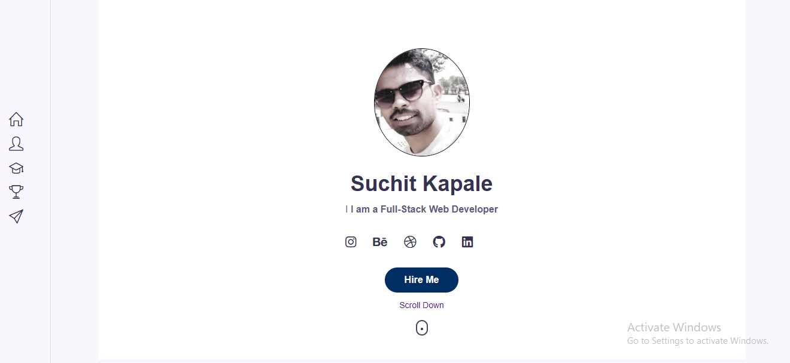

# Portfolio Website

Welcome to my portfolio website repository! This project was built using Next.js, CSS, and React hooks like `useState` and `useEffect`. It's a fully responsive website showcasing my skills, projects, and more.



🚀 [Live Demo](https://suchitkapale.vercel.app/)

## Features

- Responsive design for all devices.
- Home section with a brief introduction.
- Projects section to display your work.
- Skills section to highlight your expertise.
- Contact section with contact details and a contact form.
- Server Side Rendering.

## Technologies Used

- [Next.js](https://nextjs.org/)
- CSS for styling
- React hooks: `useState` and `useEffect`

## Getting Started

1. Clone the repository:

```bash
git clone https://github.com/yourusername/your-portfolio-website.git
